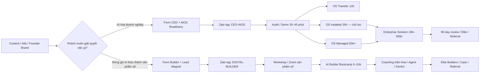

# 10 — Hai Phễu Sản Phẩm Rocket AI

> Rocket AI vận hành **hai phễu độc lập theo ý định mua**, không gom CEO và người xây sản phẩm số vào cùng một landing page, nhóm Zalo hay sự kiện chốt. Hai phễu dùng chung thương hiệu, content engine và hạ tầng tracking; từ bước thu lead trở đi phải tách tag, nurture, offer và KPI.

## 1. Quyết định kiến trúc

| Nội dung | Quyết định |
|---|---|
| Hai nhóm chính | **Nhóm 1 — CEO/SME** · **Nhóm 2 — Chuyên gia xây mô hình kinh doanh sản phẩm số** |
| Offer lõi CEO | Chuyển giao **AIOS Marketing & Sales chạy được**; không định vị như khóa học AI |
| Offer lõi sản phẩm số | **AI Builder Bootcamp** giúp đóng gói tri thức thành sản phẩm số và dựng hệ thống bán bằng AI |
| Điểm chuyển đổi CEO | **AIOS Readiness Audit / Demo hệ thống 30–45 phút** |
| Điểm chuyển đổi sản phẩm số | **Workshop miễn phí / Zoom theo chủ đề sản phẩm số** |
| Kênh nuôi | Zalo, nhưng phải dùng **hai tag và hai chuỗi nurture riêng** |
| Genful | Phễu SaaS riêng; chỉ dùng làm demo năng lực hoặc cross-sell trong hai phễu |
| Global Elite Club | Hậu mãi/retention sau mua; không phải cửa vào chung |

## 2. Bản đồ tổng thể

---

# PHỄU 1 — CEO / SME

## 3. ICP và lời hứa

**Persona:** Anh Hưng, 35–50 tuổi; chủ SME 10–100 nhân sự; doanh thu vài chục đến hàng trăm tỷ/năm; đã thử AI nhưng mới có các công cụ rời rạc; ra quyết định theo ROI và có thể cần trình ban lãnh đạo.

**Nỗi đau lõi:**

> Tôi muốn AI giảm phụ thuộc nhân sự và chuẩn hóa Marketing–Sales, nhưng từng đầu tư nhiều lần mà chưa có một hệ thống chạy được, vì tôi chỉ nhận được các mảnh rời rạc.

**Lời hứa phễu:**

> Rocket AI chuyển giao AIOS chạy được: **Business Brain → Content Engine → Sales Assistant → Lead Pipeline → Dashboard**, có người cài đặt, nghiệm thu và đồng hành theo mốc.

## 4. Hành trình CEO theo 8 giai đoạn

| # | Giai đoạn | Khách nhận gì | CTA / hành động | KPI chính | Điều kiện qua bước |
|---:|---|---|---|---|---|
| 1 | **Nhận biết** | Content phản biện “không thiếu tool, thiếu hệ thống”; founder pain; build in public; demo pipeline | `MAP`, `BRAIN`, `PIPELINE`, `AIOS` | Qualified engagement | Khách tự nhận ra vấn đề là hệ thống, không phải prompt |
| 2 | **Thu lead & phân loại** | AIOS Readiness Audit 5 lớp/10 tiêu chí | Điền form CEO | **Lead CEO đủ điều kiện** | Đúng vai trò ra quyết định, có team/quy trình và sẵn sàng triển khai |
| 3 | **Nuôi & tạo niềm tin** | Checklist, demo Business Brain, pipeline 7 trạng thái, case có số, FAQ về triển khai | Vào Zalo tag `CEO-AIOS` | Qualified lead → audit booked | Chọn được một nút thắt ưu tiên và đặt lịch |
| 4 | **Audit / Demo** | Chẩn đoán hiện trạng; demo một luồng thật; xác định phạm vi, ROI và milestone | Audit 30–45 phút | Show rate · Audit → proposal | Có bài toán, owner, timeline và phạm vi sơ bộ |
| 5 | **Proposal & chốt** | Báo giá 3 tầng, phạm vi rõ, không bao gồm rõ, nghiệm thu theo mốc | Chọn gói + deposit/hợp đồng | Proposal → won theo gói | Tiền/hợp đồng và lịch kickoff |
| 6 | **Activation 28 ngày** | Cài Business Brain, Content, Sales, Lead Pipeline, Dashboard | Demo Day + nghiệm thu | **Activation rate** | Có ít nhất một luồng thật chạy và số đo trước/sau |
| 7 | **Tối ưu 90 ngày** | Managed support, review số, tối ưu quy trình và quyền vận hành | Quarterly/90-day review | Retention · KPI improvement | Team tự vận hành hoặc tiếp tục Managed |
| 8 | **Mở rộng & giới thiệu** | Module doanh nghiệp, train-the-trainer, Elite, showcase | Enterprise proposal / referral | Expansion revenue · referral | Mở thêm phòng ban/solution hoặc giới thiệu DN mới |

## 5. Cửa vào và form CEO

**Lead magnet chính:** `AIOS Readiness Audit` — không dùng PDF chung chung làm điểm chốt chính. PDF/checklist là tài sản trao ngay sau form; giá trị thật là **được phân tích và nhìn thấy hệ thống chạy**.

**Sáu trường tối thiểu:**

1. Họ tên + vai trò.
2. Số điện thoại/Zalo.
3. Tên doanh nghiệp + ngành.
4. Quy mô nhân sự.
5. Nút thắt ưu tiên: Content / Lead / Sales / Follow-up / Dashboard.
6. Mức sẵn sàng triển khai: ngay 30 ngày / trong quý / đang tìm hiểu.

**Routing:**

- **Fit A:** chủ doanh nghiệp/BOD, có team, có quy trình đang chạy, triển khai trong 30 ngày → mời Audit trực tiếp.
- **Fit B:** đúng tệp nhưng chưa gấp → Zalo nurture + demo nhóm.
- **Chưa fit:** chỉ tìm tool/prompt/giá rẻ, chưa sẵn sàng đổi quy trình → content nurture; không đẩy sale 1-1.

## 6. Chuỗi nurture CEO 7 chạm

| Chạm | Nội dung | Mục tiêu |
|---:|---|---|
| D0 | Trả kết quả AIOS Readiness + xác nhận nút thắt | Tạo giá trị ngay |
| D1 | “5 lớp AIOS” và vì sao tool rời không thành hệ thống | Reframe vấn đề |
| D2 | Demo Business Brain trước/sau | Chứng minh phương pháp |
| D3 | Lead Pipeline 7 trạng thái + owner + next action | Gắn vào nỗi đau mất lead |
| D4 | Case/demo có số; nếu chưa có số công khai thì chỉ dùng hệ thống thật | Tăng proof |
| D5 | FAQ: thời gian, code, dữ liệu, triển khai, vai trò con người | Gỡ phản đối |
| D6 | Mời Audit 30–45 phút với agenda rõ | Booking |

## 7. Product ladder CEO

| Tầng | Offer | Giá đã có | Phù hợp | Kết quả thương mại |
|---|---|---:|---|---|
| Entry | AIOS Readiness Audit / Demo | Miễn phí hoặc theo chiến dịch | CEO đang đánh giá | Qualified opportunity |
| Core 1 | **OS Transfer** | **12tr** | Muốn nhận OS và tự custom theo lộ trình 28 ngày | Cửa vào sản phẩm hóa |
| Core 2 | **OS Installed** | **25tr** | Muốn Rocket cài + custom cùng trong 28 ngày | **Offer chủ lực** |
| Core 3 | **OS Managed** | **50tr+** | Muốn Rocket vận hành cùng 90 ngày | Giới hạn năng lực giao hàng |
| Enterprise | Solution Agent / AI Transformation đa module | **100–500tr** | DN lớn, nhiều phòng ban, cần pilot/proposal BOD | Lợi nhuận + train-the-trainer |
| Retention | Global Elite Club / review / update / referral | `[CHỜ BOD: phí & quyền lợi]` | Khách đã mua OS/Solution | LTV, case, giới thiệu |

**Luật bán:** không ép mọi CEO đi qua gói thấp. Lead đủ điều kiện có thể đi thẳng từ Audit → Installed/Managed/Enterprise. Enterprise 100–500tr phải có discovery, phạm vi, pilot hoặc proposal BOD; không bán bằng một bài quảng cáo.

## 8. KPI CEO

**North Star:** `Số cơ hội CEO đủ điều kiện tạo ra mỗi tháng`.

Đo theo chuỗi:

`Lead CEO → Qualified → Audit booked → Audit attended → Proposal → Won theo gói → Activated 28 ngày → Expanded/Referral 90 ngày`

Không dùng tỷ lệ Zoom→chốt 12–20% chung làm baseline chính thức cho CEO cho tới khi tracking tách riêng nhánh này.

---

# PHỄU 2 — MÔ HÌNH KINH DOANH SẢN PHẨM SỐ

## 9. ICP và lời hứa

**Persona chính:** Chị Phương, 30–45 tuổi; chuyên gia/coach/trainer đã có kiến thức, personal brand hoặc cộng đồng; quyết nhanh, thích tự triển khai và có năng lượng bán hàng.

**Persona phục vụ ké:** Founder/agency muốn chuyển mô hình sang AI-first; không mở ngân sách nhánh riêng.

**Nỗi đau lõi:**

> Tôi muốn đóng gói kiến thức thành sản phẩm có thể bán và nhân bản, nhưng content, bán hàng và vận hành vẫn phụ thuộc vào chính tôi.

**Lời hứa phễu:**

> Rocket AI giúp chuyên gia **đóng gói tri thức → tạo offer → dựng tài sản bán → xây content/Zoom/Agent hỗ trợ**, để hình thành mô hình kinh doanh sản phẩm số có hệ thống.

## 10. Hành trình sản phẩm số theo 8 giai đoạn

| # | Giai đoạn | Khách nhận gì | CTA / hành động | KPI chính | Điều kiện qua bước |
|---:|---|---|---|---|---|
| 1 | **Nhận biết** | Content: đóng gói tri thức, hệ thống thay vì làm một mình, AI Builder, case founder | `BUILDER` / `SẢN PHẨM SỐ` | Reach đúng tệp | Khách muốn thương mại hóa chuyên môn |
| 2 | **Thu lead** | Bản đồ 7 bước xây sản phẩm số / mini audit / starter kit | Form Builder | Data `DIGITAL-BUILDER` | Có chuyên môn hoặc tài sản có thể đóng gói |
| 3 | **Entry tùy chọn** | E-learning hoặc Bộ AI Agent 299k–999k | Mua một SKU đúng chiến dịch | Buyer lead | Có hành vi trả tiền; không trưng tất cả SKU cùng lúc |
| 4 | **Workshop / Zoom** | Workshop miễn phí về offer, product map, hệ thống bán; demo tài sản thật | Đăng ký + tham dự | Zalo → Zoom · show rate | Tham dự và hoàn thành bài chẩn đoán |
| 5 | **Core offer** | AI Builder Bootcamp, cầm tay xây tài sản và hệ bán | Chốt trong Zoom / tư vấn | Zoom → Bootcamp | Thanh toán + onboarding |
| 6 | **Activation** | Offer, thông điệp, landing/lead magnet, content, sales script, agent/template | Launch sprint / demo | Activation | Có offer và chiến dịch đầu tiên chạy thật |
| 7 | **Ascension** | Coaching triển khai, Agent, Genful, hỗ trợ personal brand | Review theo milestone | Upsell · LTV | Có nhu cầu tăng tốc hoặc mở rộng |
| 8 | **Community & referral** | Elite Builders, showcase, case study, giới thiệu | Showcase / referral | Case · referral | Có kết quả được xác minh và đồng ý công khai |

## 11. Cửa vào và form Builder

**Lead magnet chính:** `Bản đồ 7 bước đóng gói tri thức thành sản phẩm số bằng AI` hoặc workshop cùng chủ đề.

**Sáu trường tối thiểu:**

1. Họ tên + kênh cá nhân chính.
2. Số điện thoại/Zalo.
3. Chuyên môn muốn đóng gói.
4. Đã có cộng đồng/tệp khách hay chưa.
5. Sản phẩm hiện có: chưa có / dịch vụ 1-1 / khóa học / cộng đồng.
6. Mục tiêu 90 ngày: ra offer / ra mắt / tự động hóa / tăng bán.

**Routing:**

- Đã có chuyên môn + tệp khách + muốn triển khai sớm → workshop/Zoom gần nhất.
- Có chuyên môn nhưng offer mờ → chuỗi nurture về định vị, product map và offer.
- Chỉ tìm “kiếm tiền nhanh bằng AI” hoặc sưu tầm prompt → loại khỏi sale high-touch.

## 12. Chuỗi nurture Builder 7 chạm

| Chạm | Nội dung | Mục tiêu |
|---:|---|---|
| D0 | Trả bản đồ 7 bước + hỏi chuyên môn muốn đóng gói | Phân loại |
| D1 | Vì sao chuyên môn giỏi vẫn chưa thành sản phẩm | Chạm pain |
| D2 | Chọn một lời hứa và một nhóm khách, không làm khóa học “cho tất cả” | Làm rõ offer |
| D3 | Demo Product Map: lead magnet → core → coaching/tool | Cho thấy đường tiền |
| D4 | Build in public/case tài sản thật của Rocket | Proof |
| D5 | FAQ: không biết code, thiếu thời gian, từng mua khóa nhưng chưa làm | Gỡ phản đối |
| D6 | Mời workshop/Zoom “Đóng gói sản phẩm số bằng AI” | Registration/show-up |

## 13. Product ladder sản phẩm số

| Tầng | Offer | Giá đã có | Vai trò |
|---|---|---:|---|
| Free | Lead magnet / workshop sản phẩm số | 0đ | Thu data + tạo niềm tin |
| Entry | E-learning / Bộ AI Agent | **299k–999k** | Buyer list; mỗi campaign chỉ đẩy một SKU |
| Core | **AI Builder Bootcamp / Bootcamp Sản phẩm số** | **5–10tr** | Cỗ máy doanh thu của nhánh |
| Ascension | Coaching triển khai AI cho personal brand / mô hình sản phẩm số | `[CHỜ BOD: scope & giá]` | Tăng tốc và cá nhân hóa |
| Tool continuity | Genful credit / Agent | **50k–5tr** theo gói Genful | Doanh thu lặp lại theo mức dùng |
| Community | Elite Builders / showcase / referral | `[CHỜ BOD: quyền lợi]` | Retention, case, giới thiệu |

**Luật bán:** ads chỉ kéo vào lead magnet/workshop hoặc một Entry SKU để tạo buyer list. Không chạy ads lạnh bán Bootcamp. Bootcamp chốt qua workshop/Zoom đã có lịch sử 12–20% toàn hệ; phải tracking riêng nhánh Builder để xác nhận tỷ lệ thật.

## 14. KPI sản phẩm số

**North Star:** `Số khách Bootcamp được kích hoạt và đưa offer ra thị trường`.

Đo theo chuỗi:

`Lead Builder → Buyer lead/Workshop registered → Attended → Bootcamp won → Activated → Upsell → Case/Referral`

Baseline dùng để bắt đầu: Zalo→Zoom **25%**, Zoom→chốt **12–20%**. Đây là số lịch sử toàn hệ; sau 2–4 tuần phải thay bằng số riêng của tag `DIGITAL-BUILDER`.

---

## 15. Luật tách phễu bắt buộc

1. Mỗi content chỉ có **một persona + một CTA**.
2. Form đầu tiên phải hỏi khách muốn: `AI hóa doanh nghiệp` hay `Xây sản phẩm số`.
3. CRM/Zalo dùng hai tag: `CEO-AIOS` và `DIGITAL-BUILDER`.
4. Không gửi workshop sản phẩm số cho lead CEO; không gửi proposal AIOS doanh nghiệp cho lead Builder chưa qua discovery.
5. Hai nhánh dùng landing page, nurture, sự kiện chốt và dashboard riêng.
6. Lead đổi nhu cầu chỉ được chuyển tag sau khi sale xác nhận.
7. Genful được đo như một sản phẩm SaaS riêng, không gộp doanh thu vào tỷ lệ chốt Bootcamp/AIOS.

## 16. Dashboard điều hành chung

| Nhánh CEO | Nhánh sản phẩm số |
|---|---|
| Lead CEO đủ điều kiện | Lead Builder |
| Audit booked / attended | Workshop registered / attended |
| Proposal theo gói | Bootcamp won |
| Won: Transfer / Installed / Managed / Enterprise | Activation: offer/campaign chạy thật |
| Activation 28 ngày | Upsell coaching/tool |
| Expansion/Referral 90 ngày | Case/Referral |

**Chỉ số không được gộp:** CPL, show rate, close rate, CAC và LTV của hai nhánh. Hai persona có chu kỳ mua và giá trị hợp đồng khác nhau; số blended sẽ che mất điểm rơi thật.

## 17. Thứ tự triển khai

1. Tạo hai landing/form và hai tag CRM/Zalo.
2. Hoàn thiện AIOS Readiness Audit cho CEO và Bản đồ 7 bước cho Builder.
3. Viết hai chuỗi nurture D0–D6.
4. Chuẩn hóa hai sự kiện chốt: Audit/Demo CEO và Workshop/Zoom Builder.
5. Chuẩn hóa proposal CEO 3 tầng và pitch Bootcamp Builder.
6. Gắn UTM + source + persona + offer + outcome trên từng lead.
7. Chạy test nhỏ, đọc KPI riêng từng nhánh rồi mới scale ads.

## Khối bàn giao

**Đã chốt từ dữ liệu cũ:** hai persona chính · định vị “thiếu hệ thống” · giá OS Transfer/Installed/Managed · giá Builder Bootcamp · giá Solution · baseline Zalo→Zoom và Zoom→chốt.

**`[CHỜ BOD]`:** scope/giá Coaching nhánh sản phẩm số · phí/quyền lợi Global Elite Club và Elite Builders · quyền lợi cụ thể từng gói OS · tiêu chuẩn proposal Enterprise.

**Phụ thuộc vận hành:** tracking, Zalo automation, case có số, proposal 3 tầng, người chịu trách nhiệm phản hồi lead.

*Tài liệu 10 · bản canonical hai phễu · cập nhật 15/07/2026.*
