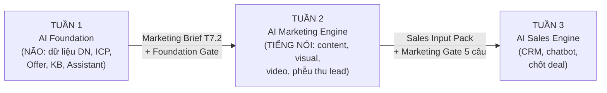
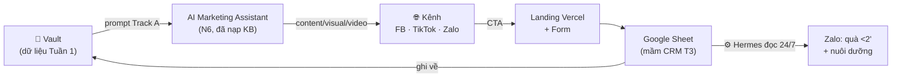
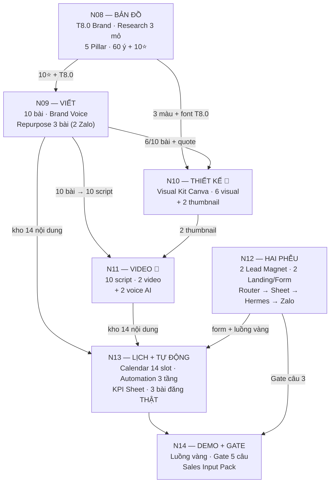

---
up:
  - "[[_MOC 28 Day AIOS]]"
created: 2026-07-15
tags: [project, aios, giao-an, framework, kien-truc]
week: 2
aliases:
  - Framework Tuần 2
  - Kiến Trúc Tuần 2
---

# 🏗️ Kiến Trúc Hệ Thống Tuần 2 — AI Marketing Engine

> **Một trang duy nhất để hiểu Tuần 2 như một HỆ THỐNG** — hợp nhất từ 3 nguồn: [[_Chuẩn Đồng Bộ Tuần 2]] (trọng tài thông số), [[Bản Đồ Vault SME ↔ Giáo Án 28 Ngày]] + [[_Blueprint Chuẩn — Cấu Trúc Giáo Án]] + [KIẾN TRÚC HỆ THỐNG bản Rocket](%5BRocket%20AI%5D%20—%20Tuần%202%20—%20KIẾN%20TRÚC%20HỆ%20THỐNG.md) (kiến trúc), và bộ Rocket AI — case thực chiến B2B: [Bảng Output & Logic](%5BRocket%20AI%5D%20—%20Tuần%202%20—%20Bảng%20Output%20&%20Logic.md) · [Audit Chuỗi Logic](%5BRocket%20AI%5D%20—%20Tuần%202%20—%20Audit%20Chuỗi%20Logic.md).
>
> **Đọc thế nào:** Học viên đọc §1 → §4 → §5. BOD/mentor đọc thêm §6 → §7. Khi con số ở đây lệch với [[_Chuẩn Đồng Bộ Tuần 2]] → file Chuẩn Đồng Bộ là trọng tài.

---

## §1. Bức tranh lớn — Tuần 2 nằm đâu trong 28 ngày

> [!abstract] Mệnh đề trung tâm
> **Tuần 1 xây NÃO. Tuần 2 biến não thành TIẾNG NÓI ra thị trường — và thị trường trả lời bằng LEAD.**

Tuần 2 **không phát minh gì mới** — nó *tiêu thụ* tài sản Tuần 1 (PDFO Map, Journey, Offer 7 khối, FAQ Database, Brand Voice, Prompt Library M-series, AI Marketing Assistant) và *sản xuất* nguyên liệu cho Tuần 3 (lead trong Sheet có trường phân loại = mầm CRM).

**Chỉ tiêu Tuần 2:** content **3 → 7 bài/tuần**, đồng thời router hai phễu chạy thông: CEO→`CEO-AIOS`→Audit và Builder→`DIGITAL-BUILDER`→workshop; quà/next step tới Zalo <2 phút.

---

## §2. Kiến trúc 3 lớp — làm ở đâu, cái gì chạy ở đâu

| Lớp | Là gì | Tuần 2 dùng vào việc |
|---|---|---|
| 🧠 **NÃO — Vault SME** (`ai-marketing-system/`, Obsidian) | Nguồn sự thật: Business Context, Brand Voice, FAQ, content bank | Mọi chiến lược, bài viết, script, copy đều **sinh từ đây và ghi về đây** |
| ⚙️ **ĐỘNG CƠ — Hermes/RocketAgent** (chạy 24/7, đã cài Tuần 1) | Agent đọc vault, hành động thay người | Theo dõi Google Sheet lead → **tự nhắn Zalo trao quà** (N12) → chuỗi nuôi dưỡng (N13) |
| 🌐 **MẶT TIỀN — Kênh & tool ngoài** | Facebook · TikTok · Zalo OA · Vercel · Canva · CapCut | Nơi nội dung **chạm thị trường** và lead **đi vào** hệ thống |

**Luồng dữ liệu chuẩn của cả tuần:**

> [!tip] Track A — logic vận hành skill xuyên suốt
> Mọi prompt Tuần 2 chạy **trong AI Marketing Assistant (Ngày 06)** — KB đã có ICP/Offer/Brand Voice/FAQ nên **không dán lại ngữ cảnh**. Prompt Tuần 2 = bản **cá nhân hoá của Prompt Library nhóm M (M01–M15, Ngày 05)**, luôn ghi rõ kế thừa mã M nào. Track B (ChatGPT/Claude thường) là phương án dự phòng: phải dán thêm khối ICP + Offer.

---

## §3. 4 Luật xuyên suốt — chấm ở MỌI ngày

| # | Luật | Nội dung 1 câu | Ngưỡng đo |
|:---:|---|---|---|
| 1 | 🔗 **TRUY NGUYÊN** | Không content nào sinh từ hư không — mọi bài/visual/video/khối landing phải mang **mã nguồn** trỏ về dữ liệu Tuần 1 (`P/D/F/O`, `J#`, `V#`, `Q##`, `OF#`, `MSG`) | ≥80% có mã nguồn · ≥30% truy về câu nguyên văn khách (`V#`/`Q##`) |
| 2 | 🤖 **TỰ ĐỘNG HOÁ 3 TẦNG** | Tự động hoá VIỆC, không tự động hoá NIỀM TIN: 🟢 AUTO (máy 100%) · 🟡 ASSISTED (AI làm, người duyệt ≥30%) · 🔴 NGƯỜI (cấm tự động: chất liệu thật, duyệt cuối, trả lời cá nhân) | N14: chỉ được 3 tầng trên hệ thống mình + nêu 1 việc **cố tình KHÔNG** tự động hoá |
| 3 | 📦 **KHO KHỚP LỊCH** | Core ngày sau không đòi nhiều hơn Core ngày trước đã giao — kho Core cộng lại **vừa khít 14 slot** lịch N13 | 10 bài (N9) + 2 video (N11) + 2 Zalo (N9) = **14 slot = 7 nội dung/tuần** ✅ |
| 4 | 🎨 **CỔNG BRAND** | Không viết một dòng content khi nhận diện chưa chốt — **T8.0 định nghĩa MỘT LẦN** (đầu N08), N9/N10 chỉ **THI HÀNH**, cấm định nghĩa lại | Từ N9: sai giọng/sai màu/sai tông T8.0 = trừ điểm "Cá nhân hoá" |

> [!danger] Ranh giới pháp lý (bất di bất dịch)
> Nói *"hỗ trợ thư giãn buổi tối"* — **CẤM**: chữa · khỏi · đặc trị · thần dược · cam kết 100% · khan hiếm giả. Vi phạm 1 lần = **−7đ + không được đăng**.

---

## §4. Chuỗi logic 7 ngày — mỗi ngày nhận gì, giao gì

**Nguyên tắc đọc chuỗi:** N08 là *bản đồ* (không sản xuất), N09–N11 là *nhà máy* (sản xuất 3 loại tài sản), N12 là *điểm chuyển đổi* (content → lead), N13 là *hệ tuần hoàn* (xếp mọi thứ vào lịch + bật tự động), N14 là *nghiệm thu* (không xây gì mới).

**Cùng một chuỗi, nhìn theo 5 lớp CHỨC NĂNG** (góc nhìn giá trị — bổ sung cho 3 lớp hạ tầng ở §2):

| Lớp chức năng | Ngày | Dòng sản phẩm | Kỹ năng học viên luyện |
|---|---|---|---|
| 1. 🎨 **Nhận diện** (Brand) | N08 → N09 → N10 | T8.0 → Brand Voice → Visual Kit | Chọn archetype · chốt màu/font · viết giọng · Canva |
| 2. 🏭 **Sản xuất** (Content) | N08 → N09 → N11 | Research 3 mỏ + 60 ý → 10 bài → 2 video | Đào insight khách · viết AI + duyệt tay · dựng CapCut |
| 3. 🎯 **Chuyển đổi** (Conversion) | N12 | Form → Landing 9 khối → Lead Magnet → Hermes/Zalo | Thiết kế phễu · copy landing · đóng PDF · setup automation |
| 4. 📡 **Phân phối** (Distribution) | N13 | Lịch 14 slot · Workflow 5 vai · Automation 3 tầng · KPI | Lập lịch · phân công vận hành · đo lường |
| 5. 🚪 **Cổng chất lượng** (Quality Gate) | N14 | Demo luồng vàng · Gate 5 câu · Sales Input Pack | Tự audit · demo · bàn giao |

**3 dependency cứng** (từ audit Rocket AI — đứt là vỡ chuỗi):

| Dependency | Đứt thì sao | Phòng ngừa |
|---|---|---|
| **FAQ Database (≥10 câu) phải có trước N09** | Thiếu nguyên liệu 3 bài xử lý phản đối | Vá ở R1/R3 của N08; R3 nạp ngược ≥10 câu mới vào FAQ DB |
| **10 bài N09 phải xong trước N10** | Không có bài để chọn 6 visual | 10 bài không cần hoàn hảo — đủ 6 bài chọn được là N10 chạy |
| **Form + Hermes phải chạy trước N14** | Fail Gate câu 3 → không vào Tuần 3 | Test luồng vàng ngay trong N12, không đợi Demo Day |

---

## §5. Lộ trình học viên từng ngày — làm gì, đạt gì, skill nào, logic ra sao

> Mỗi ngày ghi 2 số thời gian: `⏱ dùng template: X' · lần đầu tự làm: Y'`. **Luật cứu hộ:** quá giờ → làm theo ưu tiên A→D; Bonus không bắt buộc; *nộp 80% đúng hạn thắng 100% trễ 2 ngày.*

### Ngày 08 — Chiến Lược Nội Dung & Content Pillar `⏱ 135' · 180'`

- **Mở ngày bằng 2 CỔNG (10'):** đọc lại [[Template 7.2 — Marketing Brief Tuần 2|Marketing Brief]] của mình + kiểm Foundation Gate. **Fail câu 3 (Offer lệch) = DỪNG, sửa offer trước** — không sản xuất 60 ý tưởng trên offer sai.
- **Làm gì (đúng thứ tự):** ① chốt **T8.0 Brand Guideline 1 trang** (archetype + 3 màu hex + 1 font + 5 nguyên tắc giọng + Do/Don't — hợp nhất Định vị N3 + `[GIỌNG]` N5 + Brand Voice N4) → ② **Research 3 mỏ** (R1 nội bộ ≥20 dòng · R2 đối thủ ≥15 dòng · R3 thị trường sống ≥10 câu nguyên văn, nạp ngược vào FAQ DB) → ③ Content Strategy 1 trang + **5 Pillar** + Funnel Map → ④ **60 ý tưởng có mã nguồn** + chọn **10 ý ⭐**.
- **Đạt gì (Core):** 7 output — T8.0 · T8.1 Research Sheet · T8.2 Strategy · 5 Pillar · Funnel Map · 60 ý · 10⭐ (phủ ≥3 pillar, ≥2 BOF, ≥1 Journey ⚡).
- **Skill & logic:** Track A trong **AI Marketing Assistant (N6)**. Logic then chốt: **Research Sheet là INPUT bắt buộc của prompt sinh ý tưởng** — prompt không có Research Sheet = ý tưởng bịa "nghe tây". Template T8.0–T8.3.
- **Ghi vault:** Strategy/Pillar → `03. Areas/Brand & Content/` · bảng 60 ý → Google Sheet, link vào `MOC/MOC Content Calendar.md`.
- **Giao cho:** 10⭐ → N09 · T8.0 → N09/N10/N11 · 60 ý → N13.
- **⚠️ Cạm bẫy:** viết 60 ý TRƯỚC khi có Research = content bịa · chưa chốt T8.0 đã viết content = mỗi bài một giọng.

### Ngày 09 — AI Content Factory `⏱ 105' · 145'`

- **Làm gì:** ① Brand Voice Guideline 1 trang (**THI HÀNH T8.0** — chi tiết hoá giọng cho từng loại bài, không định nghĩa lại) → ② viết **10 bài từ 10⭐** (cơ cấu: ≥4 giáo dục/niềm tin · ≥3 xử lý phản đối · ≥2 bán mềm · ≥1 kể chuyện) → ③ **Repurpose Sheet 3 bài** (mỗi bài → bản Zalo + script video nháp + quote; trong đó **2 bản Zalo dùng cho lịch N13**).
- **Đạt gì (Core):** 3 output — Brand Voice Guideline · 10 bài duyệt kỹ (≥30% truy về `V#`/`Q##`, người sửa tay ≥30%) · Repurpose Sheet.
- **Skill & logic:** Track A; agent đọc giọng từ `Brand Voice` + chuyện thật từ `Nhật Ký CEO/` → bài có hồn thay vì generic. Hook/headline/CTA **lấy từ Sales Message Pack (N3) — không viết lại từ đầu**.
- **Ghi vault:** mỗi bài 1 file `03. Areas/Brand & Content/Content Đã Đăng/YYYY-MM-DD — [Kênh] — [Tên].md` + frontmatter `content_pillar/format/hook/ma_nguon` (để Ngày 23 đo được).
- **Giao cho:** 6/10 bài + quote → N10 · 10 bài → 10 script N11 · 2 Zalo → N13.
- **⚠️ Cạm bẫy:** nhận nguyên bài AI không sửa = 0% cá nhân hoá · sáng tác hook mới trong khi Message Pack đã có · dính từ cấm trong bài.

### Ngày 10 — AI Design & Visual Asset 🔴 rớt-cohort #1 `⏱ 90' · 165'`

- **Chuẩn bị bắt buộc:** xem **video Canva cơ bản 15' TRƯỚC buổi live** — đây là ngày rớt cohort #1 (người chưa từng mở Canva).
- **Làm gì:** ① Visual Brand Kit — **cài đúng 3 màu + font của T8.0 vào Canva** (cấm chọn màu mới) → ② làm **6 visual**: 2 banner (1080×1080) + 2 poster/infographic (1080×1350) + **2 thumbnail cho 2 video N11** (1080×1920) → ③ tổ chức thư viện visual.
- **Đạt gì (Core):** 4 output — Visual Kit · 6 visual gắn đúng 6 bài Core (4 bài còn lại dùng **ảnh thật**) · Bảng Kế Hoạch Visual · thư viện có tổ chức.
- **Skill & logic:** AI sinh **concept** (bố cục + chữ), Canva **thi công**. Chữ trên ảnh chỉ lấy từ **Message Pack** — phải "gạch chân được dòng Message Pack" trước khi mở Canva. Thumbnail làm được trước video vì chỉ cần **chủ đề** 2 video, không cần video xong.
- **Ghi vault:** media → `Sản Phẩm & Dịch Vụ/_Media/` · prompt tạo ảnh → `04. Resources/Templates/` · Visual Kit **nạp vào KB** để AI luôn ra concept đúng màu.
- **Nghiệm thu bằng hành động:** thu nhỏ ảnh 20% — còn đọc được chữ không?
- **⚠️ Cạm bẫy:** font không hỗ trợ dấu tiếng Việt → làm lại TOÀN BỘ · dùng ảnh AI cho sản phẩm/người thật · chỉ lưu PNG mà quên lưu file Canva gốc.

### Ngày 11 — AI Video & Audio Factory 🔴 rớt-cohort #2 `⏱ 120' · 210'`

- **Chuẩn bị bắt buộc:** xem **video CapCut cơ bản 20' TRƯỚC buổi live** — video đầu tay có thể mất 90'.
- **Làm gì:** ① **10 kịch bản video** từ 10 bài N09 (1 bài → 1 script; 3 script nháp từ Repurpose Sheet tiết kiệm ~30% công) — cơ cấu 5 giáo dục / 3 phản đối / 2 bán hàng → ② dựng **2 video hoàn chỉnh**: Video ① "chữ chạy + hình + voice AI" · Video ② **BOF gỡ đúng 1 objection thật (`O#`)** → ③ 2 file voice AI (nghiệm thu: **mở loa điện thoại nghe thật**).
- **Đạt gì (Core):** 4 output — 10 script · 2 video · 2 voice · Video Production Workflow 1 trang (5 trạm + 3 tầng tự động hoá).
- **Skill & logic:** Track A cho script; giọng AI chọn khớp cá tính T8.0; sản xuất bằng tool ngoài (CapCut/HeyGen). Research thêm bằng `/nghien-cuu-video-youtube` nếu cần tham khảo format. **Quá giờ: nộp 1 video + 10 script vẫn được chấm.**
- **Ghi vault:** script → `Content Đã Đăng/` (dạng video) · voice/video → thư viện media.
- **Giao cho:** 2 video → 2 slot lịch N13 · Workflow → Gate câu 4.
- **⚠️ Cạm bẫy:** cố làm 5 video = 5 cái dở dang · ráp hình trước voice sau = lệch tiếng · voice AI đọc sai giá/số — phải nghe lại bằng loa thật.

### Ngày 12 — Landing Page & Lead Magnet — ĐIỂM CHUYỂN ĐỔI `⏱ 110' · 165'`

- **Làm gì:** ① CEO làm AIOS Readiness + landing/form Audit; Builder làm Bản đồ 7 bước + landing/form workshop → ② ghi `persona_tag`/source vào Sheet → ③ Hermes gửi đúng tài sản và next step → ④ test hai lead giả lập, không gửi chéo.
- **Đạt gì (Core):** 5 output — Lead Magnet · Landing 9 khối · Form chạy thật · **Trao quà TỰ ĐỘNG qua Zalo** · Lead Flow Map 6 trạm.
- **Skill & logic — kiến trúc phễu 4 mảnh, 0 công cụ mới** (xem [[Module — Phễu Quà Tặng Tự Động (Vercel + Hermes-Zalo)]]): Landing (Vercel, free) → Google Sheet → **Hermes theo dõi 24/7 → nhắn Zalo quà <2'** → PDF trên Drive. Bài toán "always-on" đã giải sẵn vì Hermes chạy từ Tuần 1; khách VN sống trên Zalo nên **Zalo thắng email**. Đường siêu tắt: bí thì dùng thẳng Google Form — khâu Hermes→Zalo không đổi.
- **Ghi vault:** copy → `04. Resources/Playbooks/` · lead → `People/` (mỗi lead 1 file, chịu **Data Security Rule tầng Restricted** của N4).
- **Nghiệm thu bằng hành động:** mentor bấm link thật, điền form → lead hiện trong Sheet + quà tới Zalo <2'.
- **⚠️ Cạm bẫy:** làm PDF đẹp trước, form sau → 23h chưa có form · form bật "yêu cầu đăng nhập Google" → khách thật không điền được · khối 3 landing viết bằng lời AI thay vì `V#` nguyên văn.

### Ngày 13 — Phân Phối & Content Automation `⏱ 100' · 140'`

- **Làm gì:** ① **Publishing Calendar 14 ngày chi tiết 100%** — đúng **14 slot khớp kho Core** (10 bài + 2 video + 2 Zalo; ≥2 CTA/tuần trỏ về form N12; 2 video xếp 1 giáo dục + 1 BOF) → ② Distribution Workflow **5 vai** (Viết–Duyệt–Thiết kế–Đăng–Đo, có tên + giờ) → ③ **Automation Layer 3 tầng** (chuỗi nuôi dưỡng Zalo qua Hermes = tầng 🟡, người duyệt 10 tin trước khi bật) → ④ KPI Sheet **baseline từ Business Snapshot N1** (không bịa số mới) → ⑤ **lên lịch/đăng THẬT ≥3 nội dung**.
- **Đạt gì (Core):** 6 output — Calendar · Workflow 5 vai · Automation 3 tầng + 1 việc cố tình không tự động · Repurpose System (kích hoạt ≥2) · KPI Sheet · 3 nội dung đã đăng thật.
- **Skill & logic:** ngày này **chỉ XẾP thứ đã có, không sản xuất mới**. Lịch tại `MOC/MOC Content Calendar.md`; chạy `/do-luong-tracking` → `03. Areas/Analytics & Reporting/Tracking Plan.md` (event Zalo/Messenger/phone đã localize). Prompt kế thừa **M05** (content calendar).
- **Nghiệm thu bằng hành động:** mentor bấm link CTA trên bài đã đăng thật.
- **⚠️ Cạm bẫy:** ghi "1 bài/ngày" thay vì chuẩn Core 5+1+1 = 7/tuần · giờ đăng không có LÝ DO theo thói quen ICP · KPI baseline bịa số thay vì lấy từ N1.

### Ngày 14 — Marketing Engine Review & Demo Day 2 `⏱ 90' · 120'`

- **Làm gì:** không xây mới. ① Demo hai đường CEO/Builder từ CTA → form → tag → Zalo/next step → ② Marketing Engine Pack → ③ Marketing Gate → ④ Scorecard → ⑤ Sales Input Pack tách hai nhánh → ⑥ Catch-up Log.
- **Chuẩn demo = mức CORE:** 10 bài · 6 visual · 2 video · 1 lead magnet · form chạy · 3 nội dung đã đăng — **cấm lấy mức Bonus làm chuẩn**.
- **⚠️ Cạm bẫy:** demo bằng slide thay vì mở hệ thống thật · luồng vàng đứt vì link đòi quyền truy cập · số mở màn bịa thay vì mức Core thật.

---

## §6. Hai cổng của Tuần 2 — vào và ra

### 🚪 Cổng VÀO (đầu N08) — Foundation Gate + Marketing Brief

| Kết quả Gate N7 | Luật |
|---|---|
| 5/5 ✅ | Full Core + Bonus |
| Fail 1–2 câu (trừ câu 3) | Vào bình thường, vá trong catch-up 48h |
| **Fail câu 3 — Offer lệch** | 🔴 **DỪNG — sửa offer trước khi viết content** (N08 = buổi 1:1 sửa offer) |
| Fail ≥3 câu | Chỉ chạy Core, bỏ toàn bộ Bonus |

### 🚪 Cổng RA (N14) — Marketing Gate 5 câu = điều kiện vào Tuần 3

| # | Câu kiểm chứng | Đo bằng |
|:---:|---|---|
| 1 | Nội dung có **CHẠM**? | ≥80% có mã nguồn · ≥30% truy `V#`/`Q##` |
| 2 | Cỗ máy có **CHẠY**? | ≥3 nội dung đăng thật · lịch 14 slot khớp kho |
| **3** 🔴 | Có **ĐIỂM CHUYỂN ĐỔI**? *(câu tử)* | Luồng vàng thông: CTA → form → lead hiện Sheet → quà Zalo <2' |
| 4 | **TỰ ĐỘNG** đúng chỗ? | 3 tầng + 1 việc cố tình KHÔNG tự động hoá |
| 5 | Có **ĐO** được? | KPI Sheet baseline từ N1 + chỉ số vua + lịch điền thứ Hai |

> [!danger] Fail câu 3 = DỪNG, không vào Tuần 3 — dù điểm tuần cao. Không có lead thì Tuần 3 (CRM/sale) không có gì để chạy → 1:1 vá luồng trước.

---

## §7. Dành cho BOD — vận hành, rủi ro, nghiệm thu

### 7.1 Case study & vai trò

- 🍵 **MSX Group** — case **xuyên suốt** B2C: mọi demo live, prompt mẫu, bản điền template (vault demo `ai-marketing-system-msx-demo/`). Số MSX = **số dạy học**, cấm dùng làm proof bán hàng.
- 🚀 **RocketAI** — case **đối chiếu** B2B, chỉ mở ở 4 chỗ: N08 (pillar chuyên môn + phản biện) · N11 (video = mặt founder) · N12 (lead magnet = demo/audit 30' — bản Rocket: "AI Readiness Audit" 10 tiêu chí) · N13 (kênh = cộng đồng + webinar, không TikTok/ads).
- Sen Spa (hư cấu) đã **loại bỏ hoàn toàn**.

### 7.2 Điểm rớt cohort & phương án đỡ

| Ngày | Rủi ro | Đỡ bằng |
|:---:|---|---|
| **N10** 🔴 | Lần đầu mở Canva | Video **Canva 15'** xem trước live (bắt buộc có trong `_Kế Hoạch Video Tuần 2`) |
| **N11** 🔴 | Video đầu mất ~90'; CapCut lần đầu | Video **CapCut 20'** xem trước · quá giờ nộp 1 video + 10 script vẫn chấm |
| N12 | Hermes chưa nối Zalo OA | Fallback: người trực **gửi quà tay** trong giờ demo (vẫn phải có người cam kết trực) |

### 7.3 Nghiệm thu & rubric

- Thang 100đ giữ nguyên Tuần 1: Core 30 · Chất lượng 30 · Cá nhân hoá 25 · Dùng ngay 15. Mức: ≥80 ⭐ · 60–79 ✅ · 40–59 🔧 (24h) · <40 🔴 (1:1).
- **4 tiêu chí chấm thêm ở MỌI ngày:** truy nguyên · ranh giới pháp lý (−7đ/lần) · nhất quán T8.0 (từ N9) · **nghiệm thu bằng hành động, không bằng file** (N10 thu nhỏ ảnh 20% · N11 mở loa · N12 điền form thật · N13 bấm CTA · N14 luồng vàng).
- Điểm tuần = 60% TB N8–13 + 40% Demo Day 2.

### 7.4 Bài học từ audit Rocket AI (áp cho mọi cohort)

1. **FAQ Database & Sales Message Pack phải kiểm kê TRƯỚC N08** — 2 tài sản Tuần 1 hay thiếu nhất, ảnh hưởng dây chuyền N09/N10/N12. Fix nhanh: Message Pack tạm 30' (1 hook + 3 headline + 3 CTA + 5 angle) · FAQ 15–20 câu từ inbox trong 1h.
2. **N09→N10 là dependency cứng** — khuyến nghị lịch: N09 sáng, N10 chiều, hoặc gộp 2 ngày liên tiếp; 10 bài chỉ cần đủ 6 bài chọn được.
3. **Hạ tầng luồng vàng (Zalo OA + Hermes) xác nhận từ đầu tuần**, không đợi N12.

### 7.5 Nhịp vận hành sau khoá (SOP-08 → SOP-14)

Kho ý tưởng (quý) → viết bài (T7 sáng) → visual (ngay sau) → video (T7 chiều) → trực lead (10'/ngày) → **SOP-13 nhịp tim: T7 17h lên lịch + T2 9h đo** → review tháng. **Tổng ~2,5–3h/tuần** (vs 12h/tuần founder MSX đang tốn — đây là con số bán hàng thật của Tuần 2).

### 7.6 Phân công giảng dạy (gợi ý)

| Vai trò | Phụ trách | Ghi chú |
|---|---|---|
| **Trainer chính** | Dạy kiến thức + demo live | N08 (Brand + Content Strategy) là buổi nặng nhất về lý thuyết |
| **Mentor** | Chấm bài + gỡ rối 1:1 | Tập trung N10 (Canva) và N11 (CapCut) — 2 ngày rớt cohort |
| **AI Grader** | Chấm tự động rubric 100đ | Chạy sau 23h59 mỗi ngày, báo 🔧/🔴 cho mentor |

### 7.7 Bộ template bàn giao (24 template, `3. Bộ Template Chuyển Giao/`)

T8.0–8.3 (N08) · T9.1–9.3 (N09) · T10.1–10.3 (N10) · T11.1–11.3 (N11) · T12.1–12.4 (N12) · T13.1–13.3 (N13) · T14.1–14.3 (N14) + [[Module — Phễu Quà Tặng Tự Động (Vercel + Hermes-Zalo)]]. Mỗi template: khung "điền là xong" + 1 bản MSX mẫu + ghi chú thích ứng ngành. Bài tập 7 phiếu ✅ đã dựng tại `Tuần 2 - Bài tập/`.

---

## 🔗 Kết nối với

- [[_Chuẩn Đồng Bộ Tuần 2]] — trọng tài thông số · [[_Blueprint Chuẩn — Cấu Trúc Giáo Án]] · [[Bản Đồ Vault SME ↔ Giáo Án 28 Ngày]]
- Bộ Rocket AI Tuần 2 (cùng thư mục): [Bảng Output & Logic](%5BRocket%20AI%5D%20—%20Tuần%202%20—%20Bảng%20Output%20&%20Logic.md) · [Audit Chuỗi Logic](%5BRocket%20AI%5D%20—%20Tuần%202%20—%20Audit%20Chuỗi%20Logic.md) · [KIẾN TRÚC HỆ THỐNG bản gốc](%5BRocket%20AI%5D%20—%20Tuần%202%20—%20KIẾN%20TRÚC%20HỆ%20THỐNG.md) *(tên file chứa `[ ]` nên dùng markdown link thay wikilink; bản gốc đã được gộp toàn bộ giá trị riêng vào file này)*
- Giáo án: [[Ngày 08 — Chiến Lược Nội Dung & Content Pillar]] → [[Ngày 14 — Marketing Engine Review & Demo Day 2]]
- [[Module — Phễu Quà Tặng Tự Động (Vercel + Hermes-Zalo)]] · [[Template 7.2 — Marketing Brief Tuần 2]]
